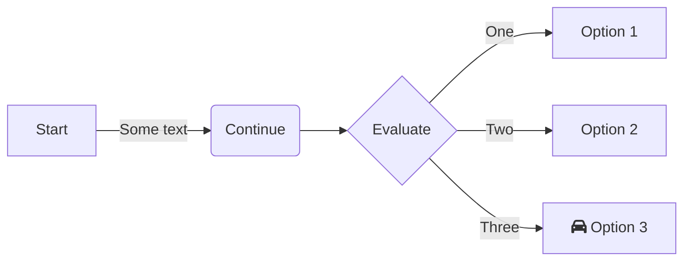

# Process: Deal → Kontrakt

Från identifierad affärsmöjlighet till signerat kontrakt med kontraktsrader.

## Flödesdiagram

## Objekt som skapas

| Steg | Objekt | Ansvarig |
|------|--------|----------|
| Identifiera affär | `fact_deal` | KAM |
| Koppla program | `dim_initiative` (CustomerProgram) | KAM |
| Välj erbjudande | `fact_deal_package_link` → `dim_commercial_package` | KAM |
| Signera avtal | `dim_contract` | KAM |
| Definiera åtaganden | `dim_contract_line` (en per tjänst/produkt) | KAM |

## Beslutsregler

- En Deal kopplas alltid till ett **Customer Program** (initiativ) — nytt eller befintligt
- Ett kontrakt kan ha flera Contract Lines — en per Offering-typ och period
- `deal_id` sätts på `dim_contract` för spårbarhet bakåt

## Se även

- [Kontrakt → Leverans](02-contract-to-delivery.md)
- [Service Catalog](../11-service-catalog/00-overview.md)
