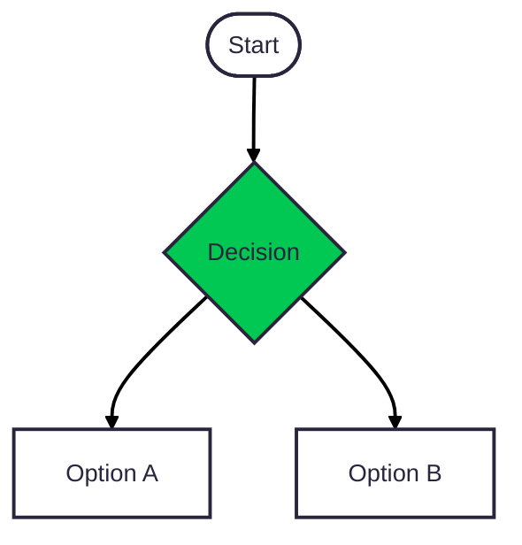

# Process: Kontrakt → Leverans

Från aktiva kontraktsrader till körbara work packages med resurser och budget.

## Flödesdiagram

## Objekt som skapas

| Steg | Objekt | Ansvarig |
|------|--------|----------|
| Starta uppdrag | `dim_engagement` | PM |
| Planera leverans | `dim_delivery_plan` | PM |
| Bryta ner arbete | `dim_work_package` (med `billing_model`) | PM |
| Definiera leverabler | `dim_deliverable` | PM |
| Sätta budget | `fact_budget_line` | PM |
| Tilldela resurser | `fact_resource_plan` | PM |
| Registrera licens | `dim_license_entitlement` | KAM |
| Koppla miljö | `dim_customer_environment` | KAM |

## Beslutsregler

- **`billing_model`** på Work Package styr hur tid omvandlas till faktura
- Varje Work Package kopplas till sin Contract Line — detta är länken som säkerställer att inget faller utanför kontraktet
- Deliverables med `must_be_accepted = true` kräver kundgodkännande innan faktura kan skapas (FastPris/Milstolpe)

## Se även

- [Leverans → Faktura](03-delivery-to-invoice.md)
- [Tidsregistrering & fakturering](../06-playbooks/time-and-billing.md)
