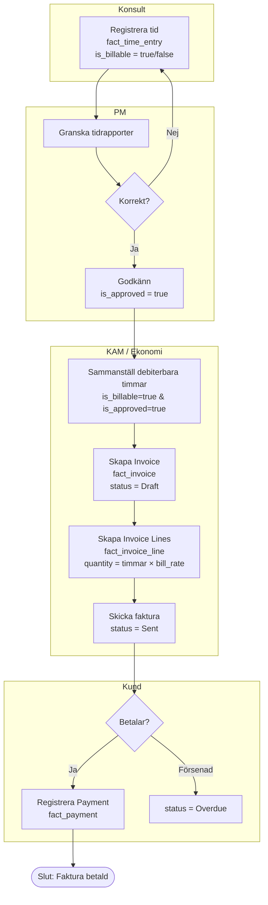
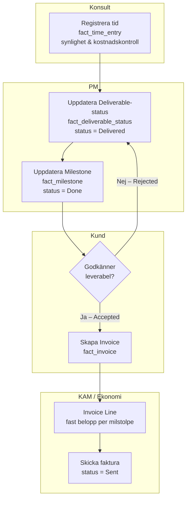
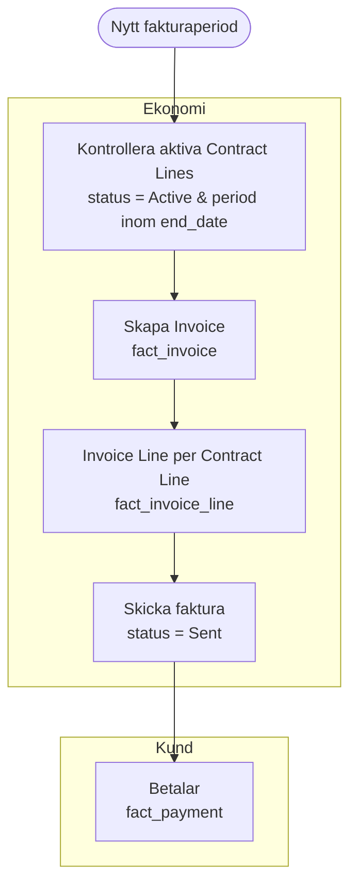

# Process: Leverans → Faktura

Från utfört arbete till godkänd tid och skickad faktura. Visar de tre
faktureringsmodellerna T&M, Fast pris och Prenumeration.

## T&M (Tid & Material)

---

## Fast pris / Milstolpe

---

## Prenumeration / Licens

---

## Objekt per steg

| Objekt | Roll |
|--------|------|
| `fact_time_entry` | Faktisk tid — `is_billable` + `is_approved` styr vad som faktureras |
| `fact_deliverable_status` | Trigger för fast pris-fakturering |
| `fact_milestone` | Alternativ trigger för milstolpefakturering |
| `fact_invoice` | Fakturahuvud — status, datum, motpart |
| `fact_invoice_line` | En rad per Work Package eller Contract Line |
| `fact_payment` | Inbetalning mot faktura |

## Se även

- [Tidsregistrering & fakturering](../06-playbooks/time-and-billing.md)
- [Deal → Kontrakt](01-deal-to-contract.md)
