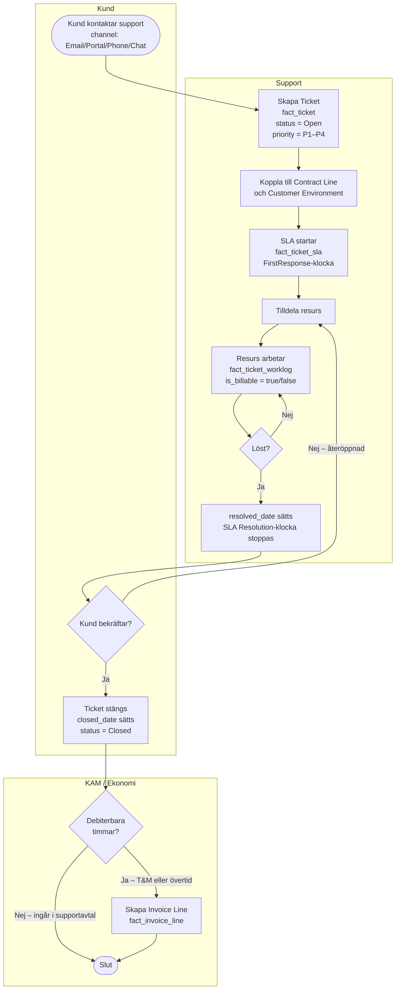

# Process: Support-flöde

Från inkommen ticket till stängd och eventuellt fakturerad.

## Flödesdiagram

## Objekt som skapas

| Steg | Objekt | Ansvarig |
|------|--------|----------|
| Inkommen kontakt | `fact_ticket` | Support |
| SLA-mätning | `fact_ticket_sla` (FirstResponse + Resolution) | System |
| Arbete loggas | `fact_ticket_worklog` (`is_billable`, `is_approved`) | Resurs / PM |
| Stängning | `fact_ticket` (resolved + closed dates) | Support |
| Fakturering vid T&M | `fact_invoice_line` | Ekonomi |

## SLA-regler

- **FirstResponse**: Tid från `created_date` till första worklog
- **Resolution**: Tid från `created_date` till `resolved_date`
- `resolved_date` ≠ `closed_date` — teknisk lösning kan vara klar innan kunden bekräftar

## Se även

- [Service Catalog: Support](../11-service-catalog/support.md)
- [Tidsregistrering & fakturering](../06-playbooks/time-and-billing.md)
