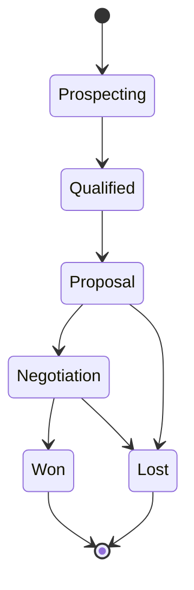
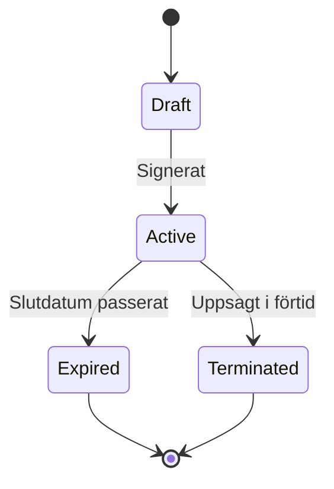
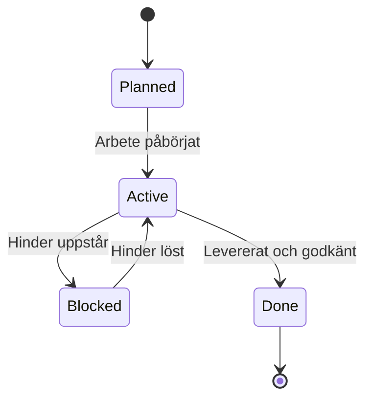
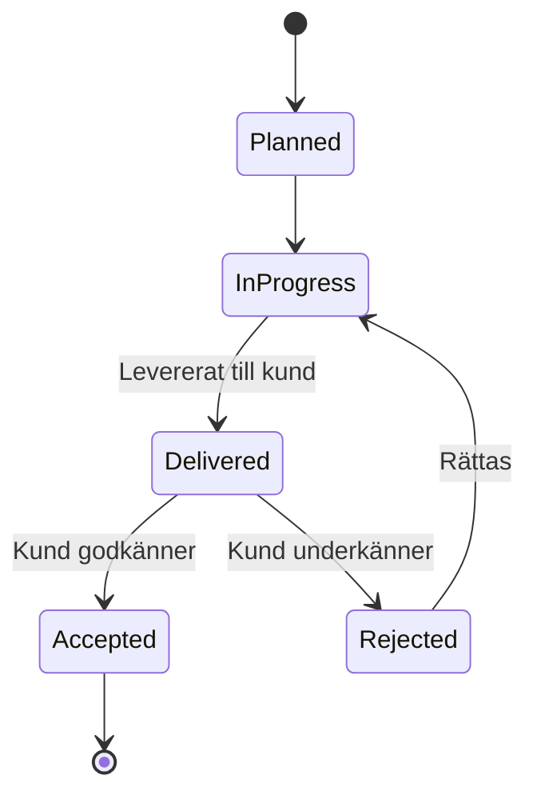
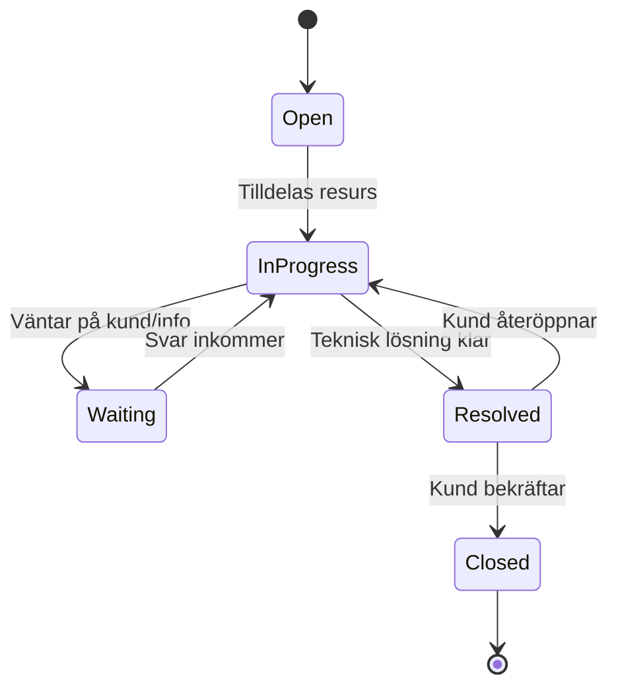
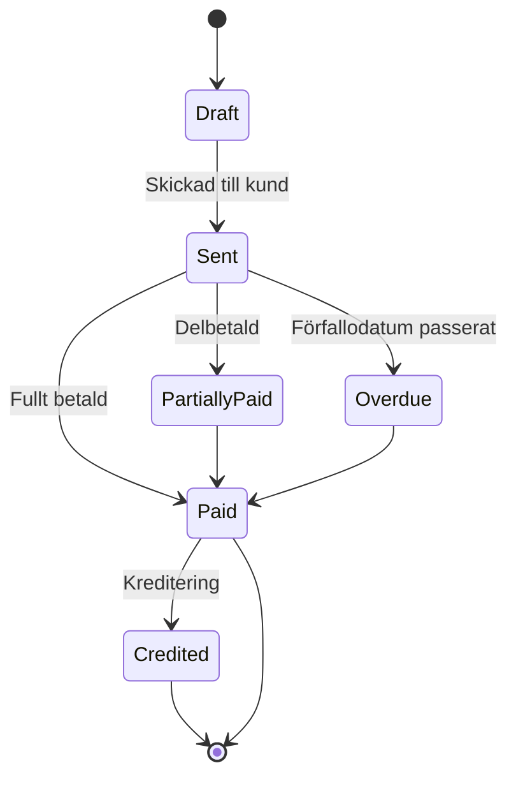
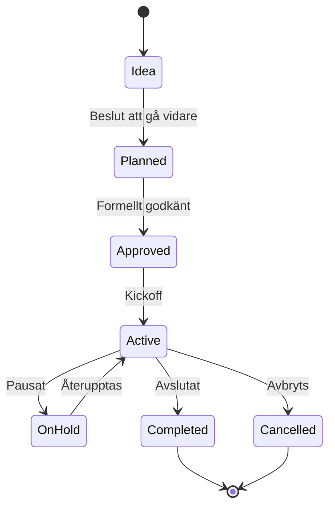

# Objektlivscykler

Status-flöden för de viktigaste objekten i modellen.

---

## Deal

---

## Contract

---

## Work Package

---

## Deliverable

---

## Ticket

---

## Invoice

---

## Initiative (Customer Program)

